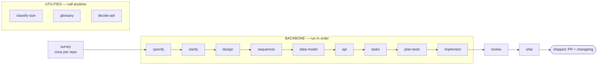

# SDD — Spec-Driven Development for Claude Code

A self-contained Claude Code plugin that carries a feature from a one-line idea to
**reviewed, verified, shipped** code through **16 atomic, stack-agnostic skills** and a
**TDD implementation engine** — with a living roadmap above the per-feature flow.

Every skill is Socratic (it walks decisions with you, it doesn't dump a wall of output),
gated (a stage hard-refuses when its prerequisite artifact is missing), and stack-agnostic
(no language, tracker, or test tool is hard-coded — the skills detect what your repo uses).
The Q&A skills (`specify` / `clarify` / `design`) are also **depth-tunable** — an easy / medium / hard
dial decides how much the skill decides for you vs. interrogates you with trade-offs.

## Install

```text
/plugin marketplace add genkovich/sdd
/plugin install sdd@sdd
```

## Start here

The flow is a straight line: **each stage writes a file the next one reads.** Run them in order
(the diagram + table are just below).

```text
/sdd-survey                         ← once per repo: map an existing codebase, OR bootstrap an empty one
/sdd-specify checkout-discounts     ← interviews you, writes the spec (you don't bring one)
/sdd-design … → /sdd-implement … → /sdd-review … → /sdd-ship
```

Two things to know up front: **`survey` runs once per repo** — on an existing codebase it maps the
current architecture to `docs/architecture-map.md` (every later stage reads it); on an empty repo it
runs a short foundation session and scaffolds the skeleton ([detail below](#where-we-study-the-codebase--hold-the-current-architecture)).
And **`specify` *creates* the spec** from a short interview — you bring the idea, not the document.

From there you walk the backbone in order. Each step reads the previous step's file and
refuses if it's missing, so you can't skip ahead by accident.

## The flow

There are three kinds of skill. Most of your time is the **backbone** — a straight line you
walk in order. A few are **utilities** you call whenever you need them. Two **close the loop**
after the code is written.



### Step 0 — survey (once per repo, before the backbone)

| # | Skill | What it does | Reads → Produces |
|---|---|---|---|
| 0 | **survey** | Existing repo → scans once, persists the current architecture. Empty repo → level-adaptive foundation session → fixes the foundation + emits a scaffold `tasks.json` for `implement`. | the repo → `docs/architecture-map.md` (+ scaffold `tasks.json` on greenfield) |

### Backbone — the straight line (run in order)

| # | Skill | What it does | Reads → Produces |
|---|---|---|---|
| 1 | **specify** | Interviews you to capture the idea, writes the product spec + acceptance criteria (reads the architecture map for constraints) | *your idea*, `architecture-map.md` → `spec.md` |
| 2 | **clarify** | Sweeps the spec for ambiguities (a devil's-advocate pass), closes or defers each | `spec.md` → tightened `spec.md` |
| 3 | **design** | **Matches the feature to your existing architecture** (see below), writes the Arc42 SAD + C4 + ADRs | `spec.md`, `CONTEXT.md` → `sad.md`, `adr/*` |
| 4 | **sequences** | Draws the runtime flows as Mermaid sequence diagrams | `sad.md` → `sad.md §6` |
| 5 | **data-model** | Designs the schema and writes the actual forward+rollback migrations | `spec.md`, `sad.md`, sequences → `data-model.md`, `*.up/down.sql` |
| 6 | **api** | Derives the OpenAPI contract from the data model + sequences + spec | `data-model.md`, sequences, `spec.md` → `contracts/openapi.yaml` |
| 7 | **tasks** | Breaks the work into atomic ≤1-day tasks + a `tasks.json` dependency DAG | all of the above → `tasks/*`, **`tasks.json`** |
| 8 | **plan-tests** | Maps every acceptance criterion to ≥1 test (inline in the spec for XS/S) | `spec.md`, `data-model.md` → `test-plan.md` |
| 9 | **implement** | The TDD engine: writes a failing test, makes it pass, gates, commits — per task | `tasks.json` + all artifacts → code + tests, committed |

### Close the loop (after the code is written)

| # | Skill | What it does | Reads → Produces |
|---|---|---|---|
| 10 | **review** | An **independent, clean-context** code review of the *whole* change against spec/AC + quality | the diff + `spec.md` → review record, `PASS` / `CHANGES REQUESTED` |
| 11 | **ship** | **Verifies the feature actually runs** (not just green tests), writes the changelog, opens the PR | the reviewed change → changelog + PR (never auto-merges) |

`review` can bounce back to `implement` if it finds an unmet acceptance criterion. `ship` is the
end: a reviewed, verified change with a changelog and an open PR — merging to main stays your call.

> **"We test and review, right?"** Yes — in two places. `implement` runs a **per-task gate**
> (unit + integration + lint + vet) on every task as it goes, so each task is green before it's
> committed. Then `review` does the **independent, whole-change** code review a human reviewer
> would do on the PR, and `ship` **runs the feature for real** against its acceptance criteria.
> Tests-pass happens continuously inside `implement`; the cross-cutting review + real-world
> verification are the explicit `review` and `ship` steps.

### Utilities — call whenever you need them (not part of the line)

- **classify-size** — size the feature XS/S/M/L/XL (writes `.size`); later skills read it to decide MVP vs full depth. Run it at the start, or any time scope changes.
- **glossary** — capture a domain term in `CONTEXT.md` with a definition. Run it whenever a new term shows up; `design` and the spec read the glossary.
- **decide-adr** — write a standalone ADR after the fact, when `tasks` (or a review) flags a decision that needs recording but wasn't captured during `design`.

## Interview depth (easy / medium / hard)

The Q&A skills open by setting a **depth dial** — one `AskUserQuestion` per run that tunes how much
the skill decides on its own vs. interrogates you. It changes *how many* questions you get, never
*what gets covered*:

- **easy** — the skill makes the reversible, low-stakes calls itself with sensible defaults, asks
  only the irreversible / high-blast-radius ones, and **lists every assumption it made** so you can
  veto. Minimal analyses; diagrams written + summarized (no per-item question).
- **medium** (default) — the balanced Socratic walk: one question per real decision.
- **hard** — walk every decision with the trade-off foregrounded, run the **full ideation analysis
  suite** (competitive research, three strategic approaches, multi-perspective review,
  devil's-advocate), and probe edge cases harder.

The default is `interview_depth` in `.claude/sdd.local.md` (else medium); override it per run, or
pass `--depth=easy|medium|hard`. Full semantics: [`skills/_shared/interview-depth.md`](./skills/_shared/interview-depth.md).

Two things the dial **never** weakens — they hold at every level:

- **Readable diagrams.** `design` and `sequences` confirm each diagram **in prose** (a plain-language
  walk of the flow + branches) and write the source to the file (where Obsidian renders it) — they
  **never dump raw Mermaid into the terminal** as the thing to approve. If `mmdc` is installed, an
  image is rendered too. ([`skills/_shared/diagram-presentation.md`](./skills/_shared/diagram-presentation.md))
- **Full use-case + acceptance-criteria coverage.** Every spec §4 user story and §5 AC is covered
  end-to-end: `specify` enforces a **use-case floor** (every user story carries ≥1 AC) and `clarify`
  re-catches a story that lost it; `sequences` maps each user story to a flow and each AC to a flow,
  a branch, or an explicit non-runtime N/A (no flow cap); and `review` traces the whole set through
  spec → sequences → data-model → api → tasks → implement, flagging anything that dropped out. Even
  `easy`/XS covers every use-case + AC — it just asks fewer questions about *how*.

## Where the spec comes from

It's not an input you have to write — **`specify` produces it.** Its interview front asks 3–5
questions about the problem, the users, and what success looks like, then drafts the spec,
validates each acceptance criterion with you, and runs a clean-context critic before writing
`spec.md`. The idea is the input; the spec is the output.

## Where we study the codebase / hold the current architecture

The existing system is studied **once, in `survey`** (Step 0), which persists
`docs/architecture-map.md` — the current architecture: module layout, layering, datastores,
conventions, and a C4 of what exists. That map is the single source of "what's already here":

- **`specify`** reads it so the spec's constraints / non-goals reflect the real system (without
  leaking tech into the acceptance criteria).
- **`design`** reads it and **matches** the feature to that reality — the SAD describes *your*
  system extended, not a greenfield design in a vacuum. It re-scans (via `explorer`) only if
  the map is missing or stale.
- **`data-model`** and **`implement`** read it for the persistence + wiring conventions the new
  code must follow, instead of each re-discovering them.

So you don't re-open "what's the current architecture?" at every stage — `survey` answers it once
and the map carries it. Refresh the map (`survey` again) when the repo has drifted past the
`reflects_commit` it records. In `design`, decisions expensive to reverse cross a blast-radius
gate and become ADRs.

**On an empty project there's no current architecture to study — so `survey` establishes one.**
Its greenfield mode gauges how you want to engage, then picks the stack / structure / data approach
/ conventions with you (defaults-heavy), fixes them as the foundation (the same map, marked
`mode: greenfield-bootstrap`, + foundational ADRs for the irreversible choices), and emits a
scaffold `tasks.json`. `implement` then materializes the skeleton — anchored on a smoke test
(«builds + boots + the test and migration tooling run») rather than per-folder TDD. After that the
repo is real and the per-feature flow builds into it normally.

## The roadmap (the portfolio layer)

The backbone builds **one feature at a time**. `roadmap` is the layer **above** it — one living
`docs/roadmap.md` that shows the work *across* features, kept at **outcome altitude** (the "why",
not a feature-and-date list, which is the biggest source of planning waste):

- **Now** — committed, spec'd, in progress. Each item links to its `docs/features/<slug>/` (it
  doesn't restate the spec) + a status.
- **Next** — problems/opportunities, deliberately *not* yet spec'd, ordered by a light **RICE**
  score (Reach × Impact × Confidence ÷ Effort). This is the candidate pool.
- **Later** — directional outcomes/themes, no detail.
- **Shipped** — what landed, with a link.

It stays current because the pipeline updates it: **`specify` promotes a feature to Now**, and
**`ship` moves it to Shipped** — delivery itself keeps the roadmap in sync, so it doesn't rot. It
carries a one-line "direction, not a promise" disclaimer and never carries dates.

## The implementation engine

`implement` reads `tasks.json`, builds a dependency DAG, and runs a **TDD cycle per task** —
`SELECT → RED → GREEN → REFACTOR → GATE → COMMIT`. It writes a failing test first, proves the
failure is for the right reason, writes the minimal code to pass, keeps refactors green, runs
the gate, and commits with `SDD-Task` / `SDD-AC` trailers.

Three execution modes, chosen automatically from settings + DAG shape (with graceful fallback):

- **Sequential single-agent TDD** — the default and the floor everything degrades to.
- **Agent team** (`team_mode: true`) — `test-author` → `implementer` → `reviewer`
  over the DAG, coordinated through a shared task list, one git worktree per agent.
- **Dynamic workflow** (`workflow_mode: auto`) — a generated `Workflow` pipeline that fans out
  independent tasks up to a parallelism cap.

## Models, effort & agents

Every skill and every agent declares an **execution profile** in its frontmatter — which model,
how much reasoning effort, and which agents it spawns:

```yaml
# a skill's frontmatter
model: opus        # haiku | sonnet | opus | inherit
effort: high       # low | medium | high | xhigh | max
agents: [critic]   # the agents this skill spawns
```

Model is chosen by the **kind of work**, not by taste:

| Kind of work | Model | Effort | Who |
|---|---|---|---|
| Judgment (spec, design, review, critique, ambiguity, strategy) | `opus` | `high` | specify, clarify, design, review · `reviewer` / `critic` / `devils-advocate` / `strategist` / `analyst` |
| Execution (write tests, write code) | `sonnet` | `medium` → `high` on escalation | `test-author`, `implementer` |
| Research / gathering (+ web) | `sonnet` | `medium` | `researcher` (competitive / adjacent-solution research) |
| Search / scan / derivation | `haiku` / `inherit` | `low` / `medium` | `explorer`; data-model, api, sequences, tasks |

The nine agents (`agents/`): **explorer** (brownfield scan), **test-author** (failing tests),
**implementer** (makes them pass), **reviewer** (independent review), **critic**
(coherence critique), **devils-advocate** (ambiguity + failure-mode hunt), **researcher**
(competitive / web research), **strategist** (three strategic approaches), **analyst**
(multi-perspective review) — the read-only ones run in **clean isolated context** (fresh eyes) and
emit only cited findings. The last three are the **ideation analyses**, dispatched by `specify` and
gated by the depth dial (easy skips them; hard runs the full suite).

The full policy — override precedence, the `.size` scaling, and the env-var fallback for the
`effort:` no-op some builds have — lives in one place: [`skills/_shared/agent-roster.md`](./skills/_shared/agent-roster.md).
Short version: if a run feels under-reasoned, set `CLAUDE_CODE_EFFORT_LEVEL`.

### Configuration — `.claude/sdd.local.md`

`implement` lazy-creates this per-project settings file (YAML frontmatter) on first run with
safe defaults; edit it to change behaviour. One key is **plugin-wide** — `interview_depth` is read
by the Q&A skills (`specify` / `clarify` / `design`) to pre-select the depth dial; the rest configure
the `implement` engine:

```yaml
interview_depth: medium    # easy | medium | hard — default depth for specify/clarify/design
tdd: true                  # enforce red→green→refactor
team_mode: false           # true → agent team via TeamCreate
workflow_mode: auto        # auto → dynamic Workflow; off → never
max_parallel_agents: 3
isolation: worktree        # worktree | inplace (parallel>1 ⇒ forces worktree)
stop_on_red: true
max_red_retries: 3
gate_lint: true
gate_vet: true
require_integration: auto  # auto | always | never (Docker-probed)
auto_commit: per_task      # per_task | per_phase | off
branch_strategy: feature   # feature | current
cmd_test_unit: ""          # empty = autodetect (escape hatch)
cmd_test_integration: ""
cmd_lint: ""
cmd_vet: ""
model_test_author: sonnet  # per-role model + effort (see Models, effort & agents)
model_implementer: sonnet
model_reviewer: opus
effort_test_author: medium # raised to high on escalation / for L-XL features
effort_implementer: medium
effort_reviewer: high
```

Command detection is a stack-agnostic cascade: settings override → Makefile targets →
`package.json` scripts → language manifests (`go.mod`, `Cargo.toml`, `pyproject.toml`, …) →
Docker probe for the integration tier.

## Quick start (idea → shipped)

```text
/sdd-survey                             # once per repo: map the current architecture
/sdd-classify-size checkout-discounts   # optional: size it first
/sdd-specify       checkout-discounts   # interview → spec (reads the architecture map)
/sdd-clarify       checkout-discounts
/sdd-design        checkout-discounts
/sdd-sequences     checkout-discounts
/sdd-data-model    checkout-discounts
/sdd-api           checkout-discounts
/sdd-tasks         checkout-discounts
/sdd-plan-tests    checkout-discounts
/sdd-implement     checkout-discounts
/sdd-review        checkout-discounts   # independent review of the whole change
/sdd-ship          checkout-discounts   # verify it runs, changelog, PR
```

Artifacts land in `docs/features/<slug>/`.

## Repository layout

```
.claude-plugin/   plugin.json + marketplace.json (self-marketplace)
agents/           explorer, test-author, implementer, reviewer, critic, devils-advocate, researcher, strategist, analyst
scripts/          validate_plugin.py (CI: manifest name/version/description + frontmatter)
skills/_shared/   canonical socratic-loop / critic / size-matrix / ask-style / interview-depth / diagram-presentation (referenced, not duplicated)
skills/<name>/    SKILL.md spine + references/ (heavy detail) + templates/ (output scaffolds)
```

## License

MIT © Kyrylo Genkov. See [LICENSE](./LICENSE).
