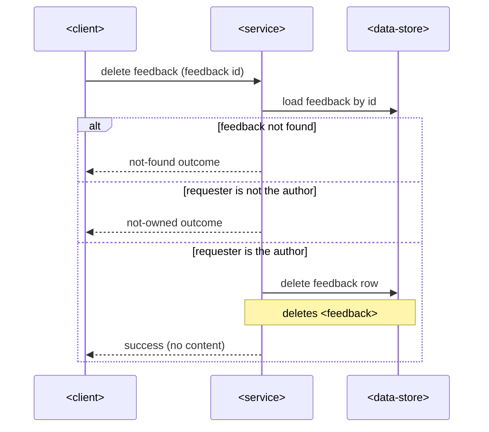

# SAD — delete-own-feedback

## 1. Introduction & goals

Let authors remove their own feedback. Reuses the existing feedback module end-to-end.

## 2. Constraints

Existing service; REST under `/api/v1`; no schema change in this slice.

## 3. Context & scope

<!-- N/A: no new external actors — the existing client calls the existing service. -->

## 4. Solution strategy

Target surface: `backend-service` (existing). Extend `internal/feedback` with a delete
use-case; the ownership check lives in the service layer (identity from the session, never
from input).

## 5. Building blocks

**No new building blocks or entities** — the existing `internal/feedback` handler → service →
repo chain gains one delete path. The `feedback` table already carries `author_id`.

## 6. Runtime

### Delete own feedback

## 7. Deployment

<!-- N/A: reuses the existing deployment unit, no infra change. -->

## 8. Crosscutting

Repo defaults: neutral error codes (`feedback.not_owned`, `feedback.not_found`), Bearer auth.

## 9. Architecture decisions

No blast-radius decisions — inline: hard delete of one's own entry (reversible, single module,
matches the repo's delete strategy).

## 10. Quality requirements

Delete completes within the service's standard latency budget; no stricter NFR in the spec.

## 11. Risks

| Risk | Severity | Mitigation |
|---|---|---|
| Accidental delete (no undo) | low — accepted debt | list refresh confirms disappearance; recreate is cheap |

## 12. Glossary

Feedback — a student comment on a lesson.
