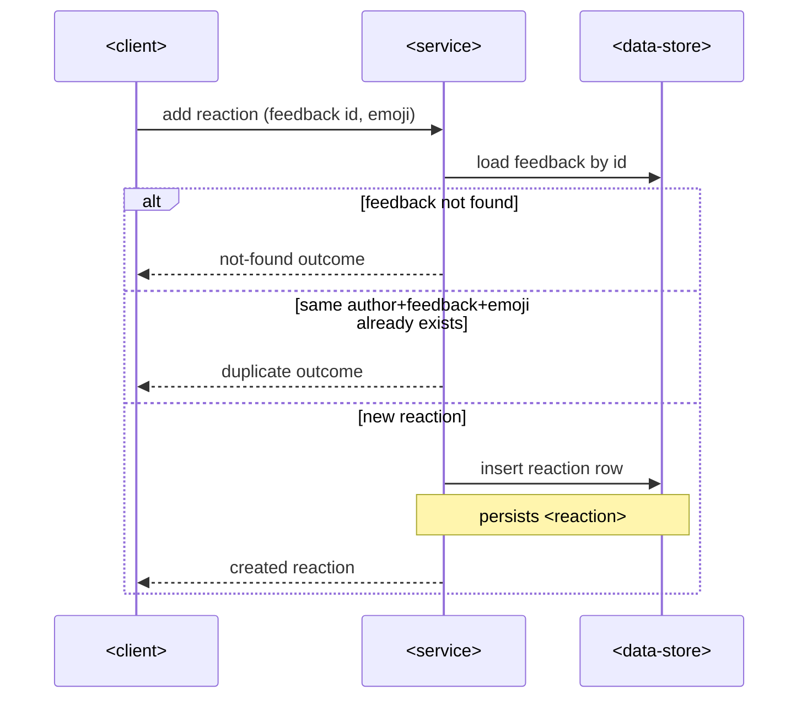
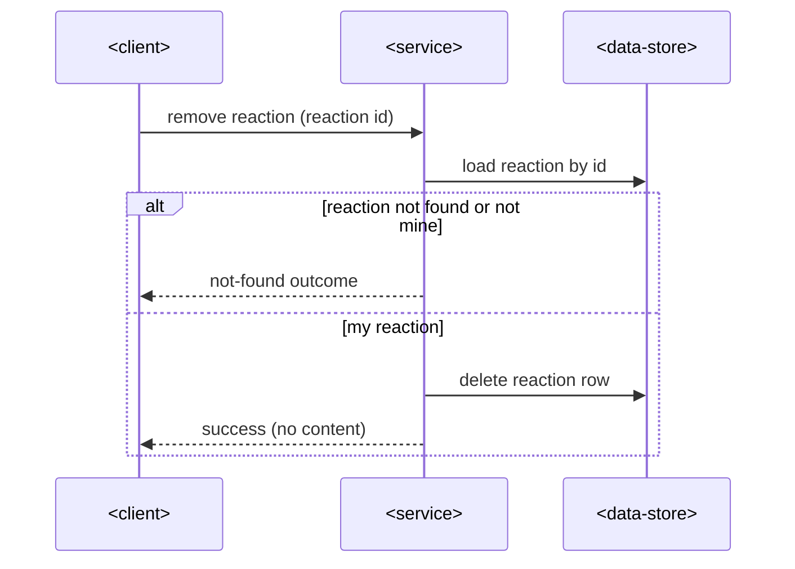

# SAD — feedback-reactions

## 1. Introduction & goals

Let students attach and remove emoji reactions on feedback entries.

## 2. Constraints

Existing service; REST under `/api/v1`; **this slice adds a new table** (see §5).

## 3. Context & scope

<!-- N/A: no new external actors — the existing client calls the existing service. -->

## 4. Solution strategy

Target surface: `backend-service` (existing). Extend `internal/feedback` with a reaction
sub-module (handler → service → repo); identity from the session, never from input.

## 5. Building blocks

**New entity: `reaction`** — a new `feedback_reactions` table (`id`, `feedback_id`,
`author_id`, `emoji`, `created_at`; **unique on author + feedback + emoji**). Staged DDL lives
in this feature's `migrations/` (`01_create_feedback_reactions`). The existing handler →
service → repo chain gains add/remove paths for it.

## 6. Runtime

### Add reaction

### Remove reaction

## 7. Deployment

<!-- N/A: reuses the existing deployment unit, no infra change. -->

## 8. Crosscutting

Repo defaults: neutral error codes (`reaction.duplicate`, `feedback.not_found`), Bearer auth.

## 9. Architecture decisions

No blast-radius decisions — inline: one flat `feedback_reactions` table with a composite
unique index (single module, matches the repo's migration conventions).

## 10. Quality requirements

Add/remove complete within the service's standard latency budget; no stricter NFR in the spec.

## 11. Risks

| Risk | Severity | Mitigation |
|---|---|---|
| Emoji storage width varies by client | low — accepted debt | bounded `emoji` column; reject over-long values |

## 12. Glossary

Reaction — an emoji a student attaches to a feedback entry.
