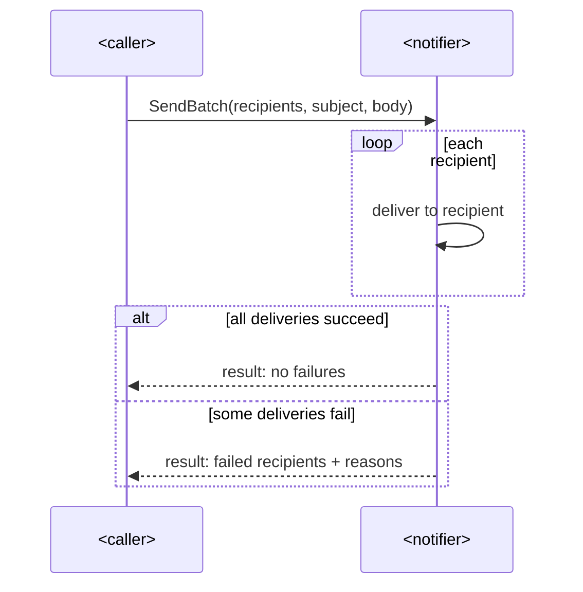

# SAD — batch-notify

## 1. Introduction & goals

Send one notification to a batch of recipients in a single call, reporting per-recipient
failures. Extends the existing `internal/notify` module.

## 2. Constraints

Existing Go service (`example.com/notify`, Go 1.22); the shared `Notifier` interface already
has two live implementations (`EmailNotifier`, `SMSNotifier`); no new deployment unit.

## 3. Context & scope

<!-- N/A: no new external actors — existing callers reach the existing notify module. -->

## 4. Solution strategy

Target surface: `backend-service` (existing). Batch semantics live in the notification
contract itself, not in each caller: the shared interface grows a batch operation and every
implementation provides it (see ADR 0001).

## 5. Building blocks

Extend the shared `Notifier` interface (`internal/notify/notifier.go`) with `SendBatch`;
**both existing implementations (`EmailNotifier` in `email.go`, `SMSNotifier` in `sms.go`)
must satisfy it — statically checked via the `var _ Notifier = (*Impl)(nil)` assertions** in
each implementation file. A `BatchResult` value (failed recipients + reasons) is the return
contract. No new packages.

## 6. Runtime

### Batch send

## 7. Deployment

<!-- N/A: same deployment unit, no infra change. -->

## 8. Crosscutting

Repo defaults: context propagation on every call; failures reported per recipient, never a
silent partial success.

## 9. Architecture decisions

| ADR | Decision | Status |
|---|---|---|
| [0001](adr/0001-extend-notifier-interface.md) | Extend the shared `Notifier` interface with `SendBatch` (no separate `BatchNotifier`) | Accepted |

## 10. Quality requirements

A batch of N recipients completes in one pass over the batch; no stricter NFR in the spec.

## 11. Risks

| Risk | Severity | Mitigation |
|---|---|---|
| Interface change breaks implementers until both provide `SendBatch` | low — caught at compile time | the `var _ Notifier` assertions fail the build until every implementation is updated |

## 12. Glossary

Batch — one notification payload addressed to many recipients in a single call.
