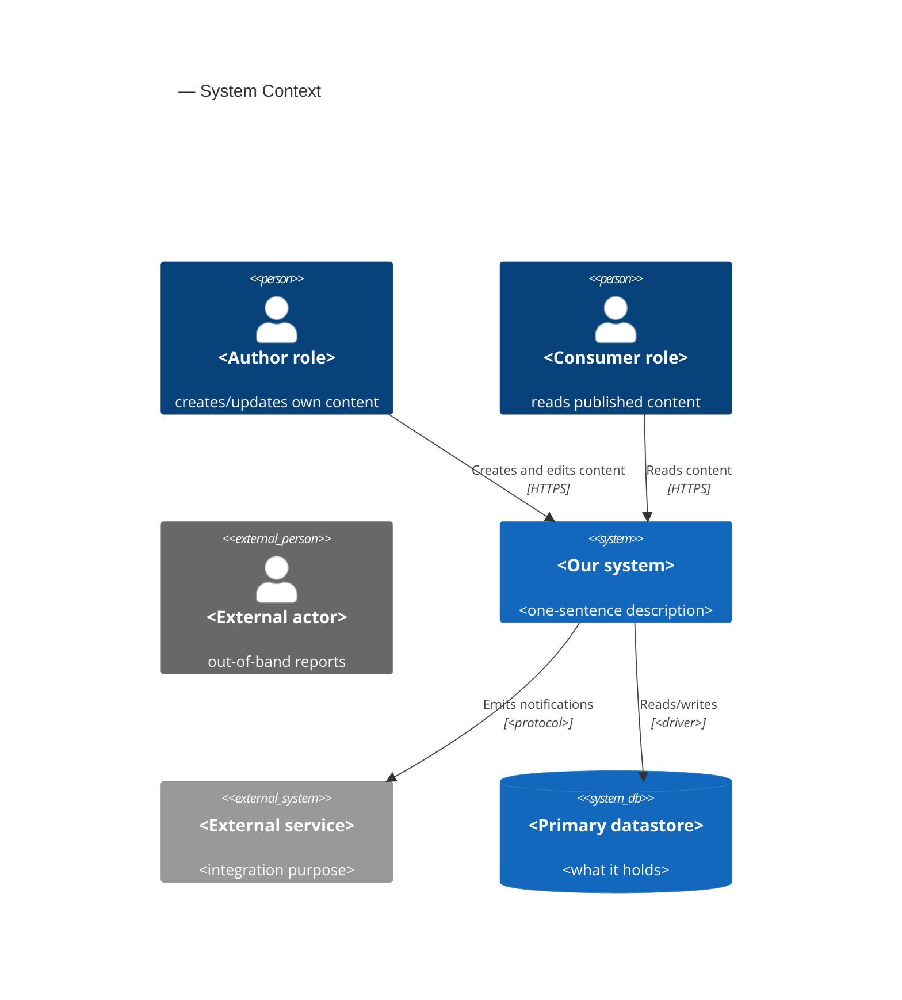
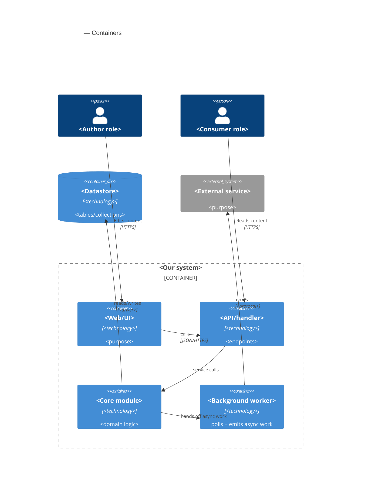

# C4 Mermaid syntax — quick reference for sad.md §3 and §5

> **TL;DR (UA).** C4 — 4 рівні діаграм як zoom на мапі. **L1 Context** (система як чорний ящик + актори + зовнішні системи) = §3 SAD. **L2 Container** (внутрішня декомпозиція: модулі, сервіси, БД, черги) = §5 SAD. L3/L4 — поза межами цього skill. *Кордон довіри* (`Container_Boundary`) — лінія, за якою дані не довіряєш без перевірки.

design emits C4 Level 1 (Context) in §3 and Level 2 (Container) in §5 as Mermaid blocks inline in `sad.md`. L3 Component and L4 Code are deliberately out of scope — request a separate diagramming pass if you need them. Mermaid renders natively in GitHub and in Obsidian.

## L1 — System Context (`C4Context`)

Use in §3. The system as one black box plus people and external systems. 5–10 elements max.



**Element types:**
- `Person(id, "name", "description")` — internal actor.
- `Person_Ext(id, "name", "description")` — external actor.
- `System(id, "name", "description")` — internal system.
- `System_Ext(id, "name", "description")` — external system.
- `SystemDb(id, "name", "description")` — external database (rare at L1).
- `Rel(from, to, "label", "protocol")` — connection; protocol is optional but recommended.

**Rules of thumb:**
- Show *your* system as one box — decomposition lives in L2.
- An external system = different owner / process / lifecycle. Internal modules of the same deployable do **not** appear in L1.
- 5–10 elements total. More than that = you're showing too much.

## L2 — Container (`C4Container`)

Use in §5. The inside of your system: apps, services, datastores, queues. For a single deployable, treat each *module* as a logical container.



**Element types:**
- `Container_Boundary(id, "label") { ... }` — groups containers inside one deployable unit.
- `Container(id, "name", "technology", "description")` — internal container (app, service, worker).
- `ContainerDb(id, "name", "technology", "description")` — internal datastore.
- `ContainerQueue(id, "name", "technology", "description")` — internal message queue.
- `System_Ext` and `Person` can be reused from L1.

**Rules of thumb:**
- For a single deployable: each module = one `Container`; the boundary brackets the whole process.
- Datastores live *outside* the boundary if they're separate processes (almost always).
- Show a background worker / scheduled job as its own container — its lifecycle matters even when it runs in-process.

## Common mistakes

- **Mixing levels.** Don't put a component (a single class/struct) inside a Container diagram — either zoom out (it's part of the Container) or move to L3.
- **Typos in `Container_Boundary`.** Common: `Container_Bondary`, `ContainerBoundary` (no underscore). Mermaid silently renders an empty block.
- **`Rel` to an undeclared element.** Declare every `Person`/`Container`/`System*` first, then the `Rel` lines.
- **L1 with internal modules.** L1 = business scope. If a module shows up in L1, you're already at L2.
- **No label or protocol on `Rel`.** «Connected» tells the reader nothing. Always: what it does + how.

## Validating before commit

```bash
# Optional pre-commit check — extracts the Mermaid block and runs the CLI parser.
npx -y @mermaid-js/mermaid-cli@latest -i <(awk '/^```mermaid$/,/^```$/' docs/features/<slug>/sad.md) -o /tmp/out.svg
```

In practice: open `sad.md` in Obsidian or push to GitHub and inspect the render — both fail loudly on syntax errors.

## When the diagram doesn't fit

- L2 over 10–15 elements → split the feature into two SADs (one per bounded context), or drop tactical containers (the worker) into a note below the diagram.
- L1 with 15+ external systems → you're documenting the *organization*, not the *feature*. Pull back to «the systems this feature directly talks to».
