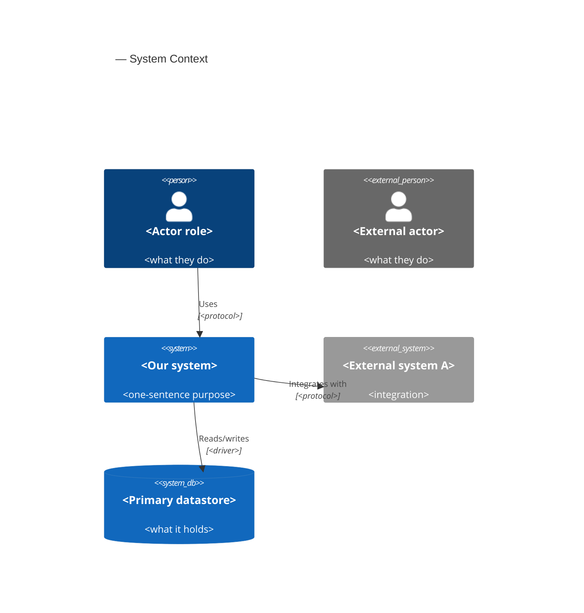
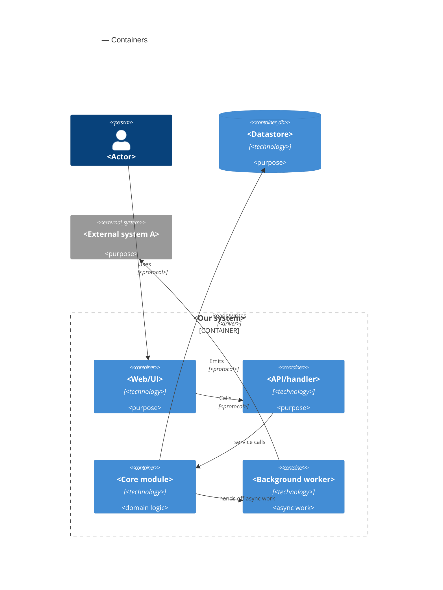

# C4 — <feature>

<!-- Two levels: L1 Context + L2 Container. In a SAD these live INLINE — Context in §3, Container in §5
     of sad.md. This standalone scaffold is for a separate diagramming pass. Syntax cheatsheet +
     rules → references/c4-mermaid-syntax.md. Real names only — no <placeholder> stubs in a final file. -->

## L1 — System Context

<!-- The system as one black box + people + external systems. 5–10 elements. Internal modules of the
     same deployable do NOT appear here — that's L2. -->

## L2 — Container

<!-- The inside of the system: apps, services, datastores, queues. For one deployable, each module =
     one Container. The worker / scheduled job gets its own Container — its lifecycle matters. -->

