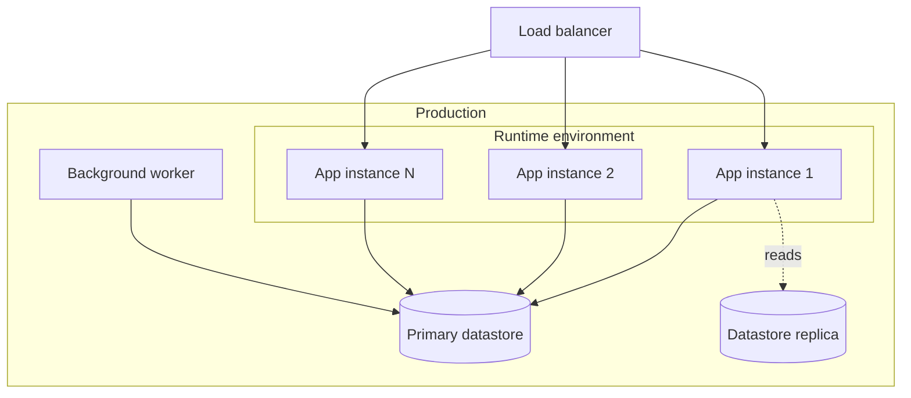

# Deployment

<!-- The runtime topology for sad.md §7 (Deployment view): where it runs, how many replicas, where the
     background worker lives, AT WHAT NUMBERS it scales. N/A allowed for XS/S that reuses an existing
     deployment unit with no change. Replace the generic node labels with your real infrastructure. -->

## Resources / scaling

| Component | Replicas | CPU / mem | Scale trigger |
|---|---|---|---|
| App | <N> | <CPU / mem> | <e.g. CPU > 70%> |
| Background worker | <N> | <CPU / mem> | <manual / queue depth> |
| Datastore | 1 primary + <N> replicas | <CPU / mem> | manual |

## Networking
- <Network policy / transport security / secrets management>
