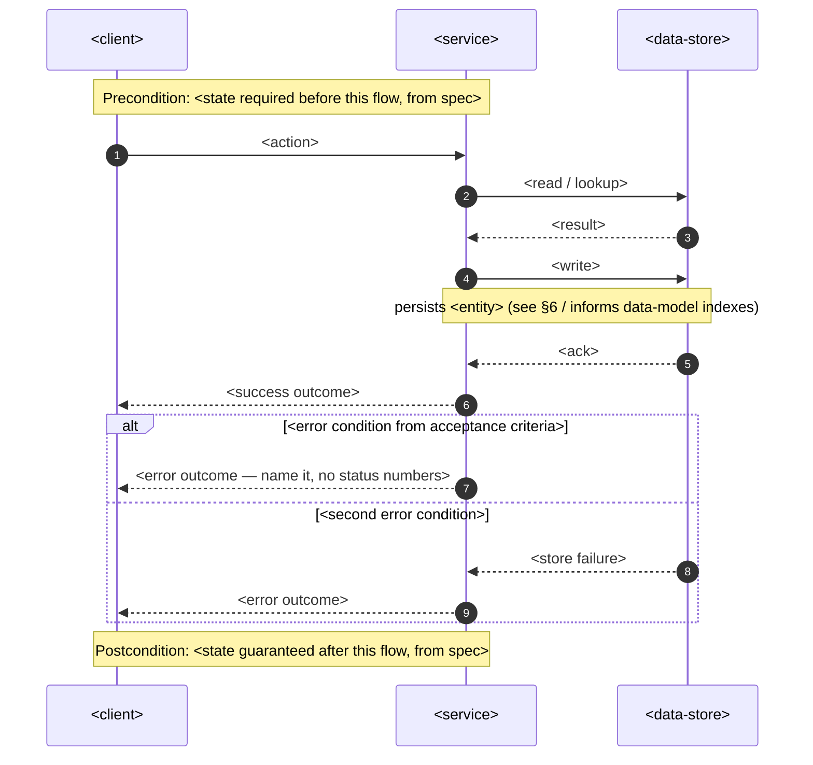
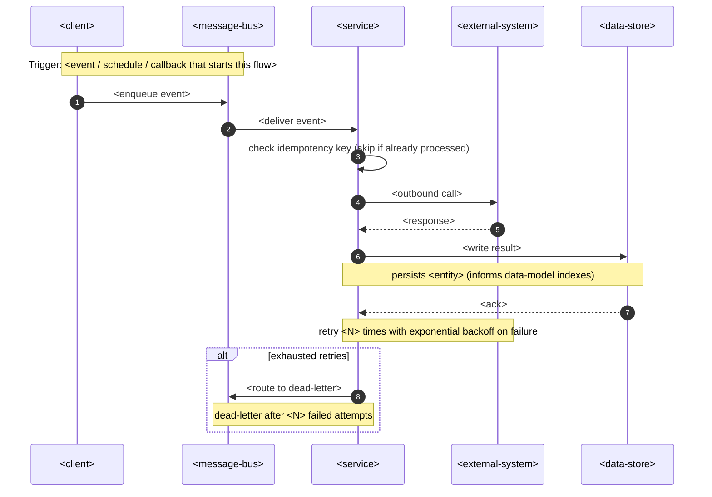

<!-- Template for `sequences` — embedded INLINE in docs/features/<slug>/sad.md §6 (Runtime view). -->
<!-- One `### <flow name>` block per critical flow. Participants are GENERIC placeholders — -->
<!-- replace the <…> message/note text with this flow's specifics, NOT the participant names. -->
<!-- Generic vocabulary (the only allowed participants): -->
<!--   <client>          — whatever initiates the flow (UI, CLI, another service, a scheduler) -->
<!--   <service>         — the building block that owns this flow (from §5) -->
<!--   <data-store>      — the persistent store the service reads/writes -->
<!--   <external-system> — a third party the service calls out to -->
<!--   <message-bus>     — async transport (queue / event stream) for non-sync flows -->
<!-- Naming the concrete technology is `design`/`data-model`'s job, not the runtime view's. -->

### <flow name>

<!-- SYNC flow: request → response, with the error branches the spec's acceptance criteria demand. -->
<!-- Every write becomes a persist note so `data-model` knows what to index downstream. -->

### <async flow name>

<!-- ASYNC flow (webhook in / scheduled job / queued or event-driven step / third-party callback). -->
<!-- MUST include: idempotency-key check as the first handler step, a retry note, a dead-letter branch. -->

