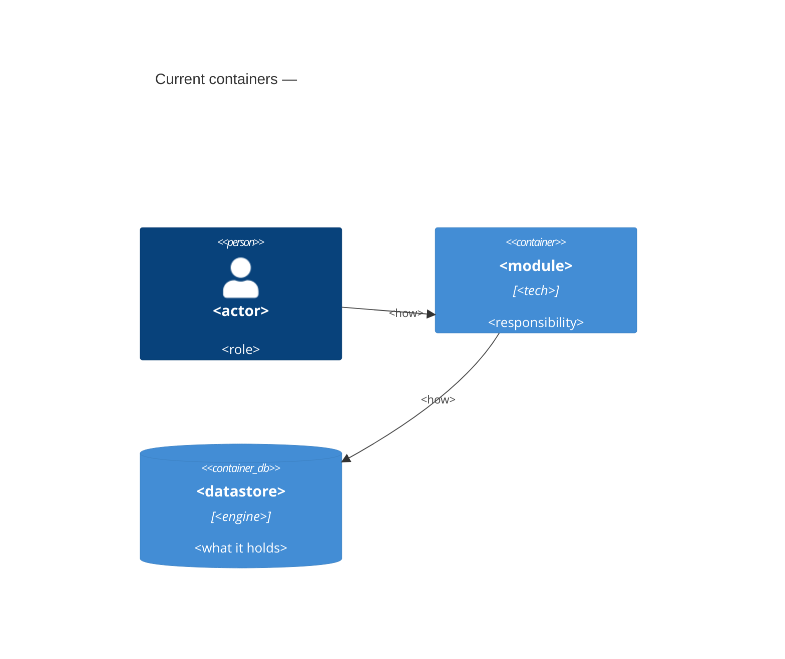

# Architecture map — <repo name>

> The **current** architecture (what exists today), produced by `survey` and read by
> specify / design / data-model / implement. Refresh with `survey` when the repo drifts past
> `reflects_commit`. This is generated; a hand-maintained `docs/architecture.md`, if present, is
> authoritative and reconciled below — not replaced.

## Stack

<!-- instruction: primary language(s) + frameworks + versions, build/test tooling. Cited. -->

- Language / runtime: <…> (`file`)
- Frameworks: <…>
- Build / test / lint: <commands the repo uses — feeds implement's detection>

## C4 — system as it is

<!-- instruction: a C4 Context + Container of WHAT EXISTS (not a target design). Real names. -->

## Module inventory

<!-- instruction: one row per top-level module/package, with its layers + where it's wired. -->

| Module | Path | Layers | Wired at | Responsibility |
|---|---|---|---|---|
| <name> | `<path>` | domain/app/infra/ports | `<file:line>` | <one line> |

## Conventions (cited — the rules a new feature must match)

<!-- instruction: the cross-cutting patterns, each with ONE cited example. These are what design/
implement must conform to. -->

- **Module wiring / registration:** <pattern> — e.g. `<file:line>`
- **Error handling:** <pattern> — `<file:line>`
- **IDs:** <pattern> — `<file:line>`
- **Persistence / DB access:** <pattern> — `<file:line>`
- **Migrations:** <naming + tool> — `<file>` (the convention `data-model` detects and follows)
- **Tests:** <unit/integration style + harness> — `<file:line>`
- **Inter-module communication:** <direct call / events / HTTP> — `<file:line>`
- **UI / styling (if a frontend exists):** <component library + styling approach> — `<file:line>` (the `ui`-layer work composes these — detail in §Frontend / UI foundation below)

## Datastores

| Store | Engine | Accessed via | Notes |
|---|---|---|---|

## Frontend / UI foundation

<!-- instruction: fill ONLY if the repo has a frontend (web / mobile / desktop). This is the UI to
REUSE — the design system + components the new `ui`-layer work must COMPOSE / EXTEND, never reinvent.
Skip with <!-- N/A: no frontend --> for a backend-only repo. Cite a file for each. -->

- **Component library / design system:** <in-repo `shared/ui/` and/or a 3rd-party kit> — `<path>`
- **Design tokens:** <colors / spacing / typography source — theme config / CSS vars / token file> — `<file>`
- **Styling approach:** <Tailwind / CSS-modules / styled-components / vanilla — the one this repo uses> — `<file>`
- **Shared primitives:** <the existing building blocks: Button, Input, Card, Modal, …> — `<path>`
- **State / data-fetching:** <store + server-cache lib, if any> — `<file>`
- **Closest UI precedent:** a new screen/component looks like `<existing screen/component>` (`<file:line>`)

## Where things live / closest precedents

<!-- instruction: a short guide — "a feature like X lives here and looks like <precedent>". Helps
design slot the new feature in and helps implement copy the right pattern. -->

- A new <kind> feature → `<path>`, modelled on `<existing feature>` (`<file:line>`).
- A new screen / UI component → composed from the existing design system (§Frontend), modelled on `<existing screen/component>` (`<file:line>`).

## Constraints & known tech-debt

<!-- instruction: things a new feature must respect or work around — version pins, a module that
forbids edits, an in-flight migration, a deprecated pattern. Feeds specify §2 / design §2 + §11. -->

- <constraint / debt> — <impact on new work>

## Reconciliation with the authored architecture doc

<!-- instruction: if docs/architecture.md (or similar) exists, note alignment + any drift found.
If none, say "no authored architecture doc; this map is the current reference." -->
