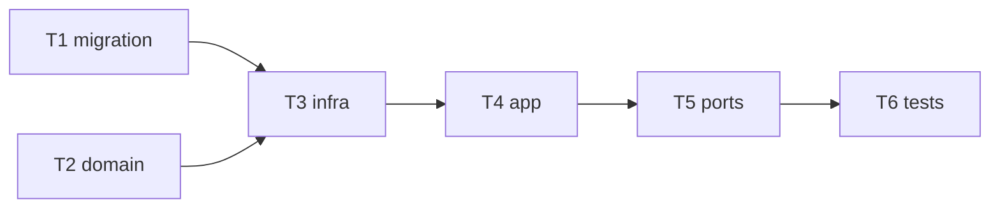

# Epic — <slug>

> **Spec:** [spec.md](../spec.md) · **Design:** [sad.md](../sad.md) · **Data model:** [data-model.md](../data-model.md) · **API:** [openapi.yaml](../contracts/openapi.yaml) · **ADRs:** [adr/](../adr/)

## Goal

<!-- instruction: 2–3 sentences — what shipping this epic delivers, tied to spec §2 Goals. -->

## Scope

- **In:** <the layers/modules this epic touches>.
- **Out:** <explicit non-scope, from spec §3>.

## Task map

<!-- instruction: the dependency graph as a Mermaid flowchart. This is the same DAG as tasks.json. -->

## Tasks

See [tracker.md](./tracker.md) for status. Machine contract: [tasks.json](../tasks.json).

| # | Task | Layer | Blocked by | DoD (short) |
|---|---|---|---|---|
| T1 | <title> | migration | — | <one line> |
| T2 | <title> | domain | — | <one line> |

## Risks / Hard rules

<!-- instruction: any spec §6 NFR / sad §11 constraint a task must not violate. -->
